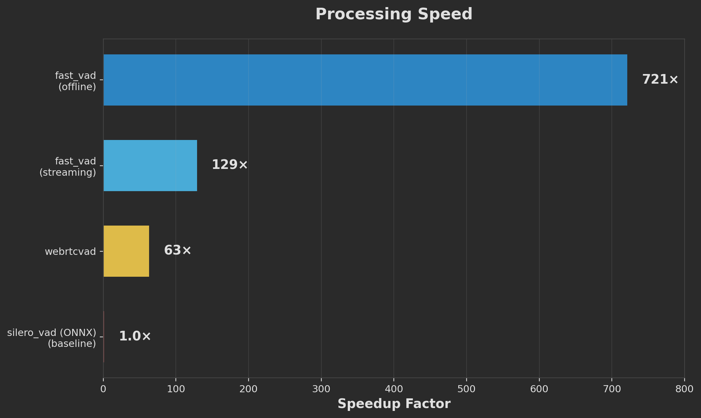
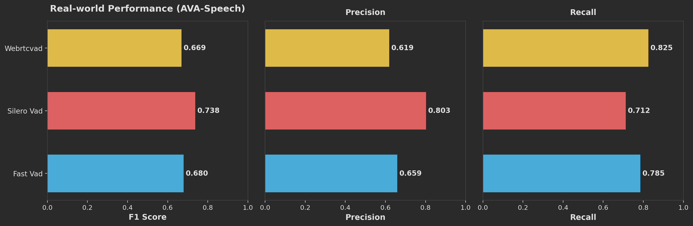
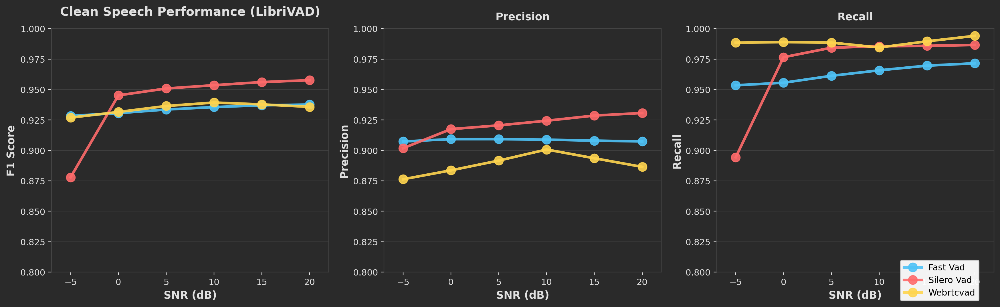
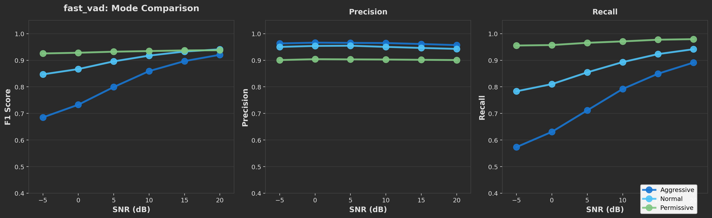

# Benchmark Notes

These plots compare `fast_vad` with two widely used open-source baselines:

- `silero_vad` using the ONNX runtime path
- `webrtcvad`

The headline result is straightforward: `fast_vad` is much faster than both baselines, while landing at a different point on the precision/recall tradeoff depending on the dataset and mode.

The point of these charts is not that `fast_vad` wins every benchmark. It does not. The point is that it is in the same general performance range as other solid open-source VAD options, while running much, much faster.

These plots were measured on **AVA-Speech** and **LibriVAD**. They are useful reference points, not guarantees for your own production data. Mic quality, background noise, language, speaking style, segmentation, and downstream post-processing can all move the operating point substantially, so you should not treat these charts as real-world metrics for every use case.

## Processing Speed



- `fast_vad` offline reaches **721x** realtime throughput.
- `fast_vad` streaming reaches **129x** realtime throughput.
- `webrtcvad` reaches **63x** realtime throughput.
- `silero_vad` (ONNX) is the **1.0x** baseline in this chart.

Two things stand out here:

- Even the streaming path is about **2x faster than WebRTC VAD**.
- The offline path is in a different throughput class entirely: about **11x faster than WebRTC VAD** and about **721x faster than the Silero ONNX baseline** used here.

That is the main case for `fast_vad`: quality that is competitive enough to be taken seriously, with a runtime profile that is dramatically better if you care about CPU cost, throughput, or latency headroom.

## Real-world Audio: AVA-Speech



AVA-Speech is the chart that keeps the story honest if you only look at raw F1:

- `silero_vad` has the best **F1 = 0.738**.
- `fast_vad` reaches **F1 = 0.680**.
- `webrtcvad` reaches **F1 = 0.669**.

The more useful reading is the precision/recall split:

- `silero_vad` is the most precise at **0.803 precision**, but its recall drops to **0.712**.
- `webrtcvad` has the highest recall at **0.825**, but the lowest precision at **0.619**.
- `fast_vad` sits between them with **0.659 precision** and **0.785 recall**.

So on messy, real-world audio, `fast_vad` does not win outright on AVA-Speech F1. What it shows instead is a reasonable middle ground:

- less trigger-happy than WebRTC VAD
- less conservative than Silero VAD
- much faster than both

That is a useful operating point when you want a fast front-end that still behaves sensibly on difficult audio, but it is not evidence that `fast_vad` is the best absolute choice for every real-world dataset.

## Cleaner Speech: LibriVAD



On cleaner, speech-centric data, the story is friendlier to `fast_vad`.

At the noisiest point shown, **-5 dB SNR**:

- `fast_vad` is at roughly **0.928 F1**
- `webrtcvad` is at roughly **0.927 F1**
- `silero_vad` drops to roughly **0.878 F1**

That suggests `fast_vad` is robust when the signal gets very noisy.

From **0 dB to 20 dB SNR**:

- `silero_vad` has the highest F1 overall, rising from about **0.946** to **0.958**
- `fast_vad` stays tightly grouped around **0.93 to 0.94**
- `webrtcvad` is close in F1, but gets there with much higher recall and noticeably weaker precision

The precision/recall plots show why:

- `fast_vad` precision stays almost flat at about **0.908** across the whole SNR range
- its recall rises gradually from about **0.954** to **0.972**
- `silero_vad` gains most of its edge from stronger recall once conditions improve
- `webrtcvad` keeps extremely high recall, but pays for it with lower precision

In practice, this makes `fast_vad` look stable and predictable on cleaner speech. It is not miles ahead on quality, but it stays close enough to strong baselines that the speed difference becomes the interesting part.

## fast_vad Mode Tradeoffs



The mode plot makes the internal tradeoff explicit:

- `permissive` has the highest recall and the strongest F1 across these SNR values
- `normal` is the best default balance
- `aggressive` pushes precision highest, but gives up a lot of recall in noisy conditions

More concretely:

- `aggressive` starts around **0.684 F1** at **-5 dB** because recall is only about **0.574**
- `normal` is much better balanced in noise, starting near **0.847 F1**
- `permissive` is the most recall-heavy mode and stays around **0.93 to 0.94 F1** across the whole SNR sweep

That gives `fast_vad` a practical advantage over single-operating-point baselines: you can choose whether your application wants fewer false positives, fewer false negatives, or a middle ground without changing libraries.

It is also worth keeping the origin of these presets in mind. `fast_vad` ships with three built-in modes, and those defaults were tuned against LibriVAD-style evaluation, which is heavily influenced by LibriSpeech-style read speech. They are good starting points, but they are not meant to be the final answer for every domain.

If you need tighter control, tune `fast_vad` directly instead of stopping at the preset modes. In Python, `fast_vad.VAD.with_config()` lets you explicitly set the main behavior knobs:

```python
vad = fast_vad.VAD.with_config(
    sr,
    threshold_probability=0.7,
    min_speech_ms=100,
    min_silence_ms=300,
    hangover_ms=100,
)
```

Those parameters let you shift the precision/recall balance for your own audio instead of relying on LibriVAD-oriented defaults. If your workload differs materially from read speech, this kind of task-specific tuning matters more than any benchmark leaderboard.

## Practical Takeaways

- `fast_vad` is not presented here as the universal best VAD. The claim is narrower: it is performance-competitive enough to be a real option, and it is extremely fast.
- Choose `fast_vad` when throughput matters, especially for batch processing, large-scale inference, or low-overhead deployment.
- Choose `silero_vad` when your priority is squeezing out the strongest absolute F1 on harder real-world audio and the extra runtime cost is acceptable.
- Choose `fast_vad` over `webrtcvad` when you want a similarly lightweight option with more control over the precision/recall tradeoff and substantially higher throughput in these plots.
- If your data is far from AVA-Speech or LibriSpeech-style speech, benchmark on your own corpus and plan to tune `with_config()` rather than assuming the preset modes are already optimal.
